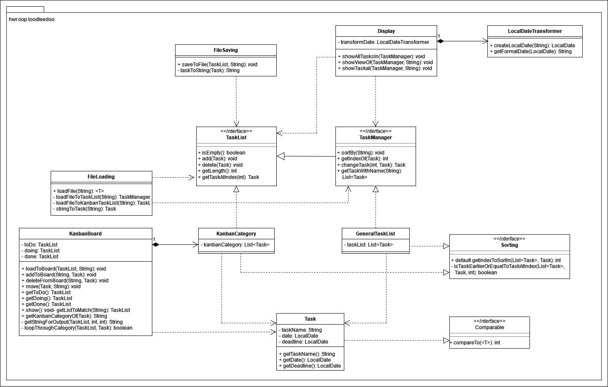

# toodleedoo

This repository contains a student project created for an ongoing lecture on object-oriented programming with Java at HWR Berlin (summer term 2022).

> :warning: This code is for educational purpose only. Do not rely on it!

## Abstract
#### 🌸🌸🌸 Welcome to toodleedoo <3 🌸🌸🌸 

 Our application "toodleedoo" is a console-based program that manages all your entered to-do’s for you. Your so-called “tasks†are sorted according to your wishes, automatically by date, and also deadline. With toodleedoo, you always have a clear to-do list at hand. In addition, this to-do application offers the function of a Kanban board, where you can see in three columns which tasks need to be completed, which ones you are currently working on and which of your "tasks" have already been finished. If the list is too full of things that you don't want to do anymore or that have been done, you can simply change or delete them, so that you always have the latest status.
    This application was programmed in Java by Emma-Sophie Betz and Begüm Nur Ak 👭🏽.  

[TODO]: # (State most important features.)
## Most important features
The most important features can be summarized as follows:
| Number | Feature         | Usage                  | Classes & Interfaces | Test files      |
|--------|-----------------|------------------------|----------------------|-----------------|
| 1      | Task management | - create a Task object with name, date and deadline - aggregate multiple tasks into one general list  | Task, TaskList, TaskManager, GeneralTaskList | TaskTest.java, GeneralTaskListTest.java |
| 2 | Kanban | - save multiple tasks into a kanban category - load saved tasks from files into their kanban categories - add tasks to and delete tasks from kanban category - move a task between kanban categories - print out kanban board | KanbanBoard, KanbanCategory, TaskList | KanbanCategoryTest.java, KanbanBoardTest.java | 
| 3 | Display | - display all tasks - display tasks filtered (and ordered) by date or deadline | Display | DisplayTest.java |
| 4 | Reusability | - save GeneralTaskList and each KanbanCategory to a file  - load data from these files back into usable objects | FileLoading, FileSaving, LocalDateTransformer | FileLoadingTest.java, FileSavingTest.java, LocalDateTransformer.java |

[TODO]: # (State the most interesting problems you encountered during the project.)
## Interesting problems we've encountered
- While for FileSaving, we could use the most general datatype of our task lists (TaskList) to implement the necessary methods, for FileLoading we had to be more specific. The interface TaskManager inherits from the interface TaskList, adding more methods and functionality to it. Therefore, more methods can be used on objects of GeneralTaskList than on objects of TaskList. That is why it was important to load the data from the GeneralTaskList-object into an object of the datatype TaskManager.
- We were successful in simulating and testing user input using InputStreams, OutputStreams and PrintStreams. The problem was that because of that, the method was not actually usable. For testing output, the OutputStream only affected the functionality in the specific test that was run. But for input testing, InputStream and PrintStream had to be given as parameters when initializing the Input object. It affected the construction of the class itself. Therefore, we could not use it in the final installment of our project.
- While doing test runs of the ManualTest, we've encountered an interesting problem multiple times. Sometimes when editing or deleting tasks from the task list, the task was not updated or deleted from the kanban board. When we then repeated the exact same process (same input, same steps), the task was updated or deleted in the kanban board. We still have not found out why the ManualTest does not work perfectly all the time.

## Feature List

[TODO]: # (For each feature implemented, add a row to the table!)

| Number | Feature                |Usage                                        | 
|--------|------------------------|---------------------------------------------|
| 1      | enter task             |to add a new task   <ul> <li> 📠 you have to give a name to your task,then enter the date when you want to work on it and by when it has to be done at the latest and last but not least, type in “yes†or “no†if you want the task to be added to the Kanban board <li> â—ï¸ make sure you write your dates in one of these formats “dd.mm.yyyyâ€, “dd.mm.yy†or “dd.mm.â€</ul>  |                                             |        |                        |                                             |              
| 2      | save to kanban board   |after you typed in a new task with the required dates, you can also save the taskto the Kanban board   <ul> <li> 📠for that you have to type in “yes†and give your task a label, so that the program knows in which column the task must be placed </ul>   
| 3      |delete task             |to delete a task, that has already been entered in the past  <ul> <li>📠if you have a task listed multiple times, you can easily choose which one to delete by typing in the number on the left side of the tasks </ul>  |
| 4      |edit task               | to update a chosen task for you and delete the old task    | 
| 5      |show tasks              |to show you the tasks you need to do,  you can also sort them by “today†to see what you need to do the current day, “this week†to see what you need to do the current week and “all tasks†to see all of your tasks |
| 6      |show tasks with filter  |to show you your tasks ordered by deadline or ordered by the date you actually wanted to finish it|
| 7      |kanban                  | here you can choose between “show†and “move task†  <ul> <li> **“showâ€:** is used to get shown your full Kanban board with the tasks you wanted to save to the Kanban board   <li> **“move taskâ€:** is used to move your tasks, which have been saved to the Kanban board earlier, between the columns “to doâ€, “doing†and “done†</ul>                       |
| 8      | what can I do?         | you can type in the exact same sentence and get shown all features you can use|
| 9      | quit                   | to end the program                                         |

## Example: How to use toodleedoo
Comment out @Disabled in ManualTest and run ManualTest. This could be your interaction:

| Console Output | Your Input |
| ---------------| -----------|
| Welcome to toodleedoo <3  Enter your next command: | `enter task` |
| Enter a task: | `grade OOP projects` |
| you've entered: grade OOP projects  Enter a date for the task: | `09.07.` |
| you've entered: 09.07. Enter a deadline for the task: | `25.07.` |
| you've entered: 25.07. Do you want to save the task to kanban? (yes/no) | `yes` |
| Which label: to do, doing, done? | `to do` |
| Enter your next command: | `show tasks` |
| Which tasks do you want to see? Enter: today, this week, all | `all` |
| 1 - grade OOP projects on 09.07.2022, Deadline: 25.07.2022 Enter your next command: | `kanban` |
| What do you want to do with kanban: show or move task | `move task` |
| Which task do you want to move? grade OOP projects | `grade OOP projects` |
| To which label do you want to move your task? | `doing` |
| *prints your current kanban board* Enter your next command: | `quit` |
| taskList has been successfully saved. toDo has been successfully saved. doing has been successfully saved. done has been successfully saved.|  |

## Additional Dependencies

[TODO]: # (For each additional dependency your project requires- Add an additional row to the table!)

| Number | Dependency Name | Dependency Description | Why is it necessary? |
|--------|-----------------|------------------------|----------------------|
| 1      | java.time | API for dates, times, instants, and durations | java.time is used to create LocalDate objects to be able to work with a given date and deadline of tasks (e.g. to compare two dates) |
| 2 | java.time.format | Provides classes to print and parse dates and times  | java.time.format is used to use a custom format for the input of dates as well as to print dates in this specific format  |
| 3 | Comparable | Java Comparable interface is used to order the objects of the user-defined class | The compareTo() method is used to compare two tasks by date to be able to have a sorted array list of tasks, beginning with the task with the nearest date, ending with the task with a date farthest in the future |
| 4 | Comparator | Java Comparator interface is used to order the objects of a user-defined class | The compare() method is used to reorder a task list based on a given filter (date or deadline) |
| 5 | java.util | java.util contains the collections framework, legacy collection classes, miscellaneous utility classes etc. | java.util is used to create collections, compare Strings (java.util.Objects) and read from the console (Scanner) |
| 6 | java.io | java.io provides for system input and output through data streams, serialization and the file system | java.io is used to save data to files and handle exceptions |

## UML diagram

